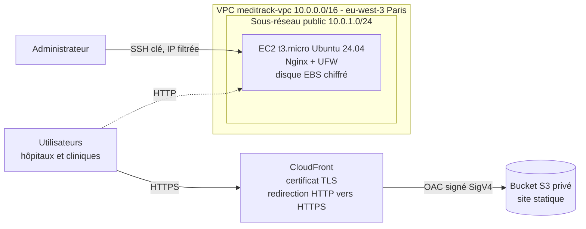

# MediTrack Cloud Deployment

Étude de cas ISCOD (Bloc 1) pour **GreenOps Solutions** : déploiement automatisé du site **MediTrack Online** sur AWS avec **Terraform** (infrastructure) et **Ansible** (configuration du serveur).

## Architecture



| Composant | Rôle | Sécurité |
|---|---|---|
| VPC + sous-réseau public | Réseau isolé dédié au projet | Groupe de sécurité : SSH limité à l'IP de l'administrateur, HTTP ouvert |
| Bucket S3 | Héberge les fichiers du site statique | Privé (blocage de l'accès public), lecture réservée à CloudFront |
| CloudFront | Diffuse le site en HTTPS | Certificat TLS, redirection HTTP vers HTTPS, accès S3 via OAC |
| EC2 t3.micro | Serveur web Nginx | Disque EBS chiffré, pare-feu UFW, connexion SSH par clé uniquement |

## Arborescence

```
.
├── terraform/            # Infrastructure as Code (AWS)
│   ├── versions.tf       # Versions de Terraform et des providers
│   ├── providers.tf      # Connexion AWS (profil CLI, aucune clé dans le code)
│   ├── variables.tf      # Paramètres
│   ├── network.tf        # VPC, sous-réseau, routage, groupes de sécurité
│   ├── s3.tf             # Bucket S3 privé + envoi des fichiers du site
│   ├── cloudfront.tf     # Distribution CloudFront HTTPS
│   ├── ec2.tf            # Instance EC2 (disque chiffré)
│   ├── outputs.tf        # URL CloudFront, IP, etc.
│   └── terraform.tfvars.example
├── ansible/              # Configuration du serveur web
│   ├── ansible.cfg
│   ├── inventory.ini     # Inventaire (IP de l'instance EC2)
│   ├── playbook.yml      # Paquets, utilisateurs, UFW, Nginx, site
│   ├── group_vars/web.yml
│   └── templates/        # Configuration Nginx
├── site/                 # Site statique MediTrack Online (HTML / CSS)
└── iam/policy-meditrack.json  # Politique IAM à moindre privilège
```

## Prérequis

- AWS CLI v2, Terraform >= 1.6, Ansible
- Un utilisateur IAM dédié (`terraform-meditrack`) avec la politique [`iam/policy-meditrack.json`](iam/policy-meditrack.json), configuré localement :
  ```bash
  aws configure --profile meditrack
  ```
- Une paire de clés SSH dédiée :
  ```bash
  ssh-keygen -t ed25519 -f ~/.ssh/meditrack -C "meditrack-admin"
  ```

## Déploiement

```bash
# 1. Infrastructure
cd terraform
cp terraform.tfvars.example terraform.tfvars   # renseigner admin_ip_cidr
terraform init
terraform fmt -check
terraform validate
terraform plan -out=tfplan
terraform apply tfplan

# 2. Configuration du serveur
cd ../ansible
# Reporter l'IP de la sortie Terraform "ec2_public_ip" dans inventory.ini
sed -i '' "s/IP_PUBLIQUE_EC2/$(terraform -chdir=../terraform output -raw ec2_public_ip)/" inventory.ini
ansible-playbook playbook.yml --syntax-check
ansible-playbook playbook.yml

# 3. Vérification
curl -I http://<domaine>.cloudfront.net    # 301 vers HTTPS
curl -I https://<domaine>.cloudfront.net   # 200
```

## Gestion des secrets

- Aucune clé AWS dans le code : Terraform utilise le profil `meditrack` (`~/.aws/credentials`).
- Le `.gitignore` exclut l'état Terraform (`*.tfstate`), les variables locales (`*.tfvars`), les clés SSH et les exports de clés (`*.pem`, `*.csv`).
- Seule la clé SSH **publique** est envoyée à AWS ; la clé privée reste sur le poste.

## Maîtrise des coûts

- Instance `t3.micro`, pas de NAT Gateway, CloudFront `PriceClass_100`.
- Après validation, l'instance EC2 peut être supprimée sans couper le site (servi par CloudFront + S3) :
  ```bash
  terraform destroy -target=aws_instance.web
  ```
- Suppression complète : `terraform destroy`.
